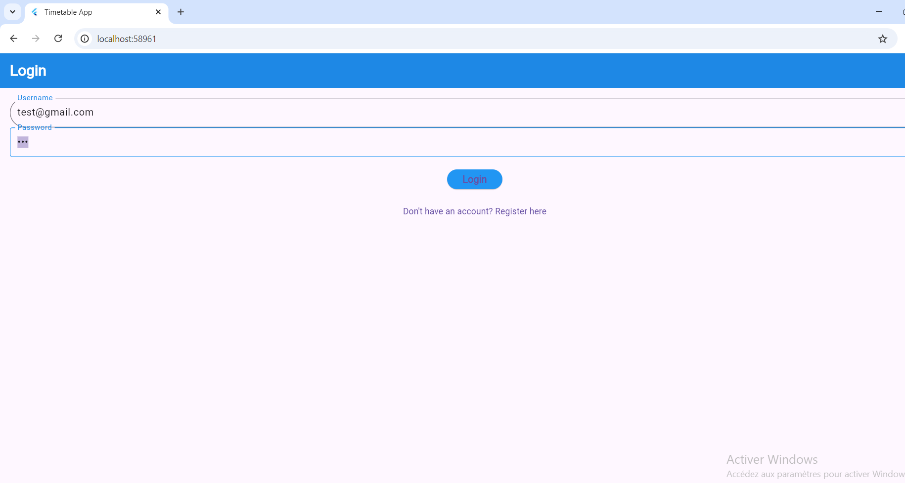
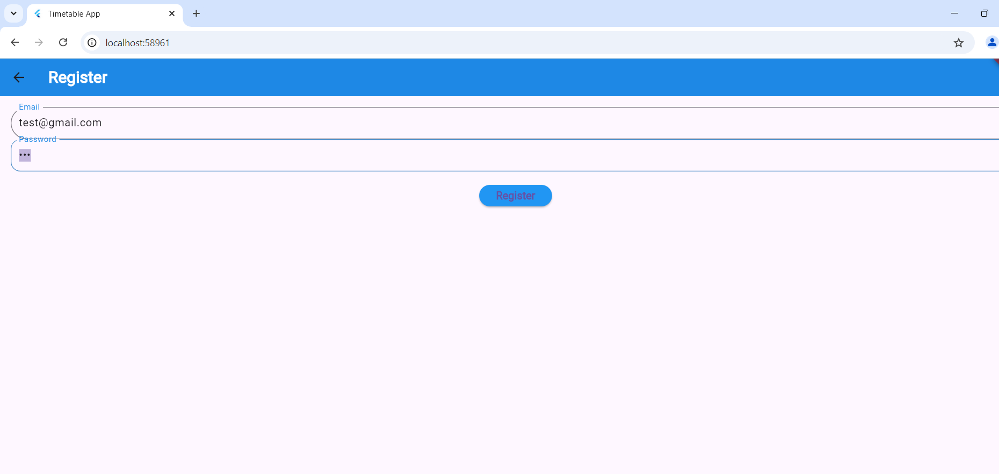
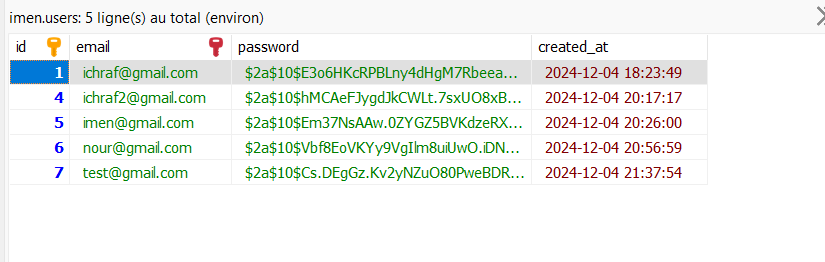
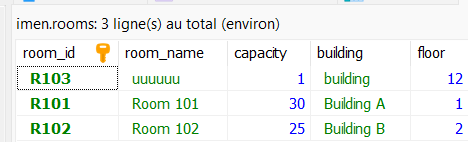
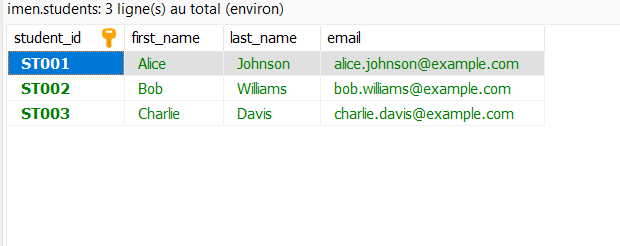

# TimeApp

**TimeApp** is a time management application built with **Flutter** and a **MySQL** backend. It aims to help users manage their time effectively by allowing them to log in, register, and track their time-related tasks.

## Features

- **User Authentication:**
  - Login screen for registered users.
  - Registration screen for new users.
  -logout
  
- **rooms Management:**
  - Add, edit, and delete rooms
 

- **Home Screen:**
  - Displays a list of tasks with options to view, edit, or delete.

## Screenshots

  
*Login Screen*

  
*Home Screen*

#database

  
*users data*

  
*rooms data*
  
*student data*

## Installation

### Prerequisites

- Flutter SDK
- MySQL database

